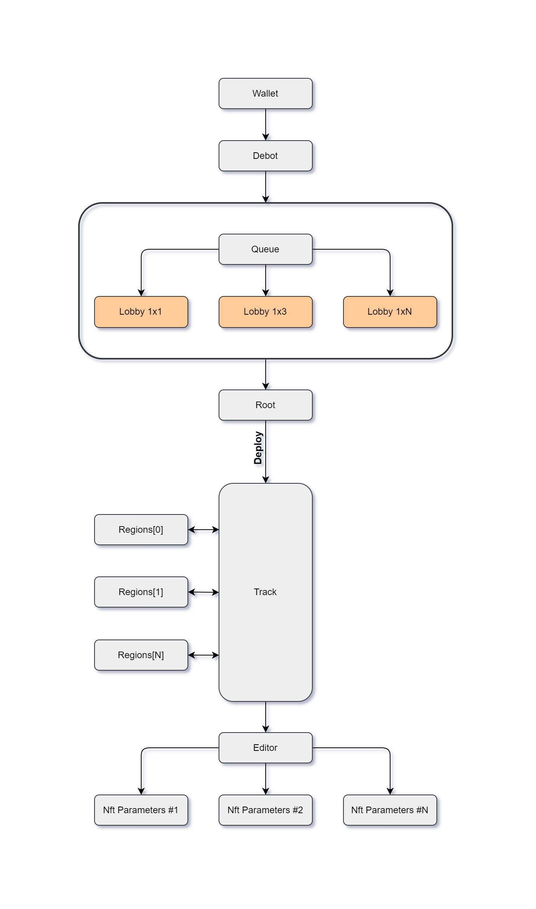

# 🏁RustCupGame

**TODO:** add game description.

## How to play?

First collection is sold out!

Buy car on secondary markets [Rust Cup Game Cars Collection #1](https://grandbazar.io/collection/rust_cup_game_cars)

Open [debot's browser](https://ever.surf/) and run debot: ```0:645ce51da11cb1cddbb0c0de848c4dbda46f75470602bb3e2b6ce9fd28727e8e```

or scan QR code


## How it work?

All logic inside blockchain on smart contracts



### Wallet
It's your wallet, that own your car NFT

### Debot
DeBot technology makes end-to-end decentralization when working with Smart Contracts.
It's decentralized interface for interaction with game smart contracts.

You can see your cars, current tracks and run to race.
### Queue
Queue contract collect cars before race started

### Root
Root contract is waiting request from ``Queue`` with cars and modifications. It's generating new random ``track`` and activate ``track``. 

### Track
Every tracks consist random set of regions. When race on track started:
- Track collects info about regions
- For every regions
- - A random number is thrown from 1 to 100
- - Calculate cars points score for region
- After last region
- - Compare cars points
- - Distributes rewards 
- - Update cars statistics use ``Editor`` contract

### Editor
The ``Editor`` update cars statistics in ``Car parameters`` contracts

### Car parameters
The ``Car parameters`` store statistics for car. 

## How to calculate points?
Car contains parameters:
| Name            | Description                                                                                |
|-----------------|--------------------------------------------------------------------------------------------|
| **SPEED**       | The maximum speed at which the cars is moving                                              |
| **ACCELERATION**| The time it takes the cars to accelerate from 0 speed                                      |
| **BRAKING**     | The time it takes the cars to reset the speed to 0                                         |
| **CONTROL**     | A coefficient that allows you to effectively pass turns and difficult sections of the route|

Region contains parameters:

Car contains parameters:
| Name                   | Description                                                                         |
|------------------------|-------------------------------------------------------------------------------------|
| **Control coefficient**| Randomness factor in the game, affects the final points on the site                 |
| **Max input speed**    | Maximum input speed for region                                                      |
| **Max output speed**   | Maximum output speed for region                                                     |

Car points are calculated use a formula. 

## Regions

Regions info:
| Type    | Address                                                               |Control coefficient|Max input speed|Max output speed|
|---------|-----------------------------------------------------------------------|-------------------|---------------|----------------|
| **D0**  | ``0:17230bf369f4d28e9960ea5a07af15733313c36f2d83fc692cd730306165d7a1``| 30                | 90            | 90             |
| **D30** | ``0:ffc3b7c614434368677621a385dea6610e305aad52a7082d09f90ff9c7aee091``| 15                | 60            | 60             |
| **D60** | ``0:8a79e2e720ea73302595ea63313ec5d84ad2488e73a7a8c234721cd2b4d0a178``| 15                | 45            | 45             |
| **D90** | ``0:ad8e5a4aec95d0821c103150fa4e7953c22b9d32cc65d8920f1917174dfe574f``|  0                | 30            | 30             |
| **D120**| ``0:337947d04e76b762195efcee51924369cf69e9291af0591875b7e9f15957100c``| -15               | 15            | 15             |  
| **D180**| ``0:c66fe5636a622f57c5223c097b5ec90bd7ccc8291836f03baa981b9b5f992302``| -15               | 15            | 15             |
| **S**   | ``0:f2bfe1e91279f2b6a191e459a1af59aa2a0a451b4af4bc41ed2c1bc74ab9a8de``| -30               | 30            | 30             |

## Car parametrs
| Name                  | Address                                                               | SPEED | BRAKING | ACCELERATION | CONTROL |
|-----------------------|-----------------------------------------------------------------------|-------|---------|--------------|---------|
| **Pussy cat**         | ``0:48fe05c7d5b0aefe9a48d43faed3b4279f302a8c979f00071048b80371e92566``| 45   | 15       | 85           | 65      |
| **Super JetMan**      | ``0:8138d31ca370662ffe139f73efa7799b8b26ae3ab614621c0947e47182ae48d8``| 85   | 50       | 50           | 25      |
| **Fly**               | ``0:2e972871d5b315219283e69eb350b6b9bf68041b4e49e057b5eceb0d6e1bcdf7``| 85   | 75       | 25           | 25      |
| **Centaur Kent**      | ``0:9e48413c8744c85643e049a3432a4f3cd49cdb8fda3022c7223a39478fc93244``| 60   | 40       | 40           | 60      |
| **Baron**             | ``0:b0d662a8f76a052c04fab48e56c990242f41a85bc02b8fd4e2d561a8eca9eaae``| 15   | 85       | 25           | 85      |
| **Victory**           | ``0:9e0b2c58248df082747fa797164b67580644fd9265b0f4d25d82a56ff09f7499``| 80   | 25       | 75           | 20      |
| **E2E4 Robot**        | ``0:414896f38cf4bb3d6f61fb0d41eaacc98ede0f801691d346df484fac79745b39``| 30   | 50       | 45           | 85      |
| **Mr. T 34**          | ``0:2ac69de249bb01935e7ef94169cea2fe707bd9bb7835a0154f30ec57c62e76cf``| 30   | 70       | 70           | 30      |
| **Tommy Snailetty**   | ``0:0c837708b38d91bcacbf0819f21d2b94b984536c4ddbeb031e004c96c03c08ee``| 15   | 85       | 55           | 55      |
| **Validatosaurus Sex**| ``0:b4726f057e721b23cabfeaaceb4c8f9cfa9ec59415dd91bdf9a084bc00b16047``| 30   | 85       | 15           | 80      |
| **Botticelli**        | ``0:7c653b79c54abbb9dc4e4e376967e4ec809730b8f30214cdf331cac236c8c640``| 20   | 60       | 60           | 60      |
| **Proffesor O**       | ``0:15243bcca507f71b0dd59a2755ab1aaf7b0457848ac947e371a5c8086ac37573``| 20   | 75       | 30           | 75      |
| **Pearjack**          | ``0:97a221222061ad3a8afc8281aaf7bc5d50e39cac2dcbf305ab6d21fe1a03d90f``| 60   | 30       | 50           | 60      |
| **Crucian carp Joe**  | ``0:cec304267de42a2a7a7bc85c3d76f62aef9761023c66c3361ae7822b689d1b8f``| 55   | 45       | 55           | 45      |
| **The Bug #2**        | ``0:e6026ae040fafec713fe539bdb1415aaa879ee1ee62bb2ce97943df461fc063c``| 55   | 80       | 60           | 15      |
| **Zombie Paul**       | ``0:8955c75187a5e6002f479203bf3ff41e38fde747a2567ff5987e4af17153a009``| 20   | 80       | 20           | 80      |
| **Looping Loooi**     | ``0:20e6ceee4df124768012fdd08e710aaa7523158dc2e8da3cb962c176d67b4e2d``| 75   | 15       | 85           | 35      |
| **Putins Welsh Corgi**| ``0:6438786aabba96e0a494795c1101706d0ff040220593fe681f1ac964c91208e4``| 40   | 20       | 80           | 60      |
| **Farmers Dream**     | ``0:8e2062f50d300aa30ad3b58e7d79420ee6ef8c8a066bb9b46d3cc250bdcefe79``| 25   | 50       | 50           | 85      |
| **Le coq**            | ``0:c79c73f21a4768d6f514603334ddacf8423f3a58b8004c221b288545fd7d57a0``| 40   | 50       | 75           | 35      |
| **Soyuz - 1000**      | ``0:20966298545627e19801826ee8ae21254feccb8b09d01a6245cdb02712078752``| 85   | 25       | 85           | 15      |
| **Courier Steve**     | ``0:9c2f97e8568219739cacb7fea8563fca0417d9c0f9b948b205ab49953368d34a``| 40   | 40       | 60           | 60      |
| **Jessie**            | ``0:fecf38573722deee205a75ea676fa4972bfb2a3f0bcbd41e0169efdd72464369``| 40   | 60       | 40           | 60      |
| **LADA 4x4**          | ``0:389a66bb3b1a0094b53e369c5d7438dc9b7a6a6e36d85e32db57c6d37078965c``| 55   | 70       | 15           | 70      |
| **Air Force One**     | ``0:ed8924685daab1a787d3c59e3b698d34b7699e0febc0ee053428c8284be0b0bd``| 80   | 20       | 80           | 20      |
| **Fantom**            | ``0:1eb132d338227df677506fb42595c334708c122e474f1275aee293ba8ca024ee``| 45   | 55       | 55           | 45      |
| **Wohn Jick**         | ``0:fa567c38123fd8bdf691745e904862dee3b70ddf9a551e114b75cc47ac15b347``| 75   | 30       | 65           | 30      |
| **Gandalfs wagon**    | ``0:c23e2627db9594e0186cca59bac4a7291edead98ea99b67eeebd7032772a916e``| 25   | 75       | 25           | 75      |
| **Party Bus**         | ``0:69a360d0b0e6b5f8395d664beaaca938b09d6b93cacbc567da581015b5bf9ad2``| 45   | 55       | 45           | 55      |
| **Your wifes car**    | ``0:276be1e026162c89da4231e7499431800498cc24b3ff30912fa4b5f5336f5647``| 50   | 50       | 50           | 50      |
| **Thunder McKing**    | ``0:6e8730dea15ed14597201d4ef41de0f9735ef375d8d3ab76813757416e4cf8cb``| 75   | 25       | 75           | 25      |
| **Time Traveller**    | ``0:403e6ea89b2d586e4d7d4d543b69ada333a9a6e87a395e1ef3429a8418f60e29``| 65   | 50       | 50           | 35      |

## Economics

| Name                      | Value      |
|---------------------------|------------|
| **Race participant count**| 4          |
| **Cost of participation:**| 20 ever    |    
| **Prize fund:**           | 80 ever    |

| **Distribution of funds:**| Value          |
|---------------------------|----------------|
| **1'st place:**           | 60%  (48 ever) |
| **2'st place:**           | 30%  (24 ever) |
| **3'st place:**           | 0%             |
| **4'st place:**           | 0% ()          |
| **Platfom**               | 10%* (8 ever)  |   

\* Platform paid gas fee ~4ever

