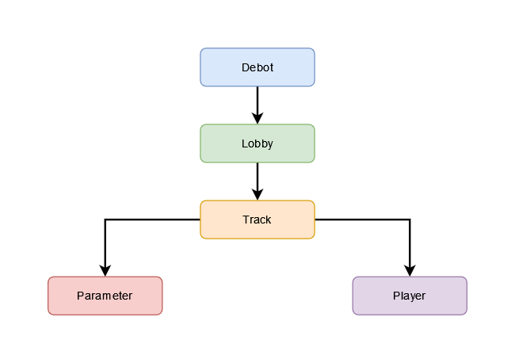
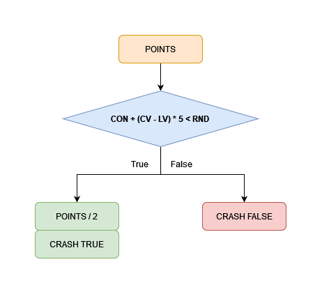
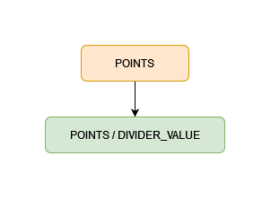
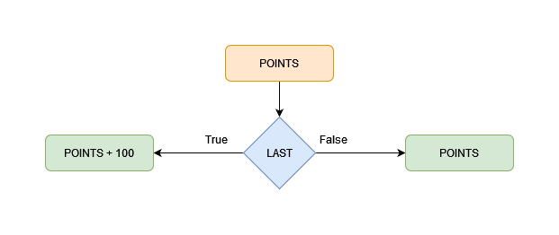

# 🏁RustCupGame V2

__Buy unique racing cars as NFTs. Find rivals for a 1x1 race or 4-participants race in every man for himself mode.
Each race takes place on a unique track with its characteristics generated at a random.
Rustcupgame is a game with indirect control. Your task is to select and upgrade your car so that it wins the competition.
Ready… steady... GO!__

* [How to play?](#how-to-play)
* [How it work?](#how-it-work)
   * [Wallet](#wallet)
   * [Debot](#debot)
   * [Queue](#queue)
   * [Root](#root)
   * [Track](#track)
   * [Editor](#editor)
   * [Car parameters](#car-parameters)
* [How to calculate points?](#how-to-calculate-points)
* [Regions](#regions)
* [Cars](#cars)
* [Economics](#economics)

## How to play?

> TODO: Add how to play

## How it work?

All logic inside blockchain on smart contracts.

## More information

* [Lobby](docs/Lobby.md)
* [Track](docs/Track.md)
* [Player](docs/Player.md)
* [Parameter](docs/Parameter.md)

## How to calculate points?
#### Car contains parameters:
| Name            | Description                                                                                |
|-----------------|--------------------------------------------------------------------------------------------|
| **SPEED**       | The maximum speed at which the cars is moving                                              |
| **ACCELERATION**| The time it takes the cars to accelerate from 0 speed                                      |
| **BRAKING**     | The time it takes the cars to reset the speed to 0                                         |
| **CONTROL**     | A coefficient that allows you to effectively pass turns and difficult sections of the route|

#### Region contains parameters:

| Name                   | Description                                                                         |
|------------------------|-------------------------------------------------------------------------------------|
| **VEL**    | The parameter of the speed of movement on the region                                            | 

#### Formula notations:
| Name                   | Description                                                                         |
|------------------------|-------------------------------------------------------------------------------------|
| **RN (Region Number)**    | Current region number   |
| **POINTS**    |  Points for the region   |
| **CV (Current Velocity)**    | VEL parameter of the current region   |
| **LV (Last Velocity)**    | The VEL parameter of the previous region   |
| **LAST**    | Whether the region is the last, True - the region is the last   |
| **DIVIDER_VALUE**    | The parameter controls the number of points scored, the current value of the parameter = 2   |
| **RND (Random)**    | Random number from 1 to 100   |
| **CRASH**    | Whether control was lost, True - it was lost   |
| **SPD (Speed)**    | Car speed parameter   |
| **ACC (Acceleration)**    | Car acceleration parameter   |
| **BRK (Braking)**    | Car braking parameter   |
| **CON (Control)**    | Car control parameter   |

## Step #1
[Full size](https://viewer.diagrams.net/?tags=%7B%7D&highlight=0000ff&edit=_blank&layers=1&nav=1&title=Untitled%20Diagram.drawio#R5Vxdc5s4FP01fswOSCDwY%2BOkH7tNk8addvcRGxnYBcuDcWz3168wEhgJO2SacGt4MrqSQJyDztW90niEJ8nuQ%2Bqtwjvm03iEDH83wjcjhEzTtflPbtkXFmIbhSFII180qgzT6CcVRtlsE%2Fl0XWuYMRZn0apunLPlks6zms1LU7atN1uwuP7UlRdQzTCde7Fu%2FRH5WVhYXeRU9o80CkL5ZJOMi5rEk43Fm6xDz2fbIxO%2BHeFJylhWXCW7CY1z8CQuRb%2F3J2rLgaV0mbXpcJf8ePx5n%2Bxvvl5d7T6M7%2F%2B8%2BxpcmVgMLtvLN6Y%2BB0AUWZqFLGBLL76trNcp2yx9mt%2FW4KWqzWfGVtxocuO%2FNMv2gk1vkzFuCrMkFrV8xOn%2B77z%2FH7Ys%2FiNudyjc7GqlvSgVY80HeBIDYVqzTTqnZ14ciW%2FJSwOanQMIlVTxb5yyhPIB8Y4pjb0seqoPxBMfW1C2q%2FjgF4KSF9AjRvnkxRvxpIf7T1%2B%2BTbntUDQMjb6KnBzpbRhldLryDlhs%2BRStE7GI4njCYpYe%2BuLFgpL5nNvXWcr%2Bo0c1vjOeGRUFTzTN6O48CTpmogMmYtRCElxR3Fbzy5STJjyaW5bxRiibZKCT4Jc%2FbtH1gUX80SXBFqoTjJHCXDHrRC%2BFvHIYv8CnA8qnWWOzIrcrPtuomgWpaqYuayNEYj7g6xm%2FCPKLxy%2FHGicqU1krLfzxs8qmKmHIktlm%2FWIV9D3qLhpVkMxdOlu8kgq69UlSavmRDLoNKui%2BmQpaGivThxz%2FEeLva7ybTMrr68e%2FXtXv%2BDZ1fasJcRfNMCGvg3iJsEQcQTseZA1VqNyWQoUwpFBhkNUxBM4YdJkrh3nOIUy%2BH%2BSHeEmuJULxjc%2FfB%2BEccINUdeoc5POPGPqW8isVVv7KWR2%2FOk5LtqQKqMLkxVGw5MU5h4hy%2B3UOYMQD8XeiIol8%2FzDBmgirT7rXYEBZw5YJiSMGSAMD%2BM0YMDUG3nvxuscUqGFEU6DYLQVDjRMRbuuubUg3gtyBLqfa8%2BOA8oNf6uaFHzfsXnp5NSCB9%2FK2RpAWAl5c2GcqaykLPN8oNw9OwHxh0bX8eC1wWMdDWyGVWMpPuyGH1OkKCQ8tTDAVBjCGZkAPE%2FrNgBqowTMAGyXArUKLHFKbZBNolODAJl2N358fcmLGdZR0RZqCnYgSeF1ePZQkoE2AwwOs7xD1fIGlpqDAF1hyuXGxOxLYbuskxpAiZKGh4GzBir2ecWiZEsK91Hw1JQSv%2BXpQfcEnASSq4Ckga6g7%2F5Y8xPusLoHu%2FFuwR8jgtnra80NA%2BdHTHFL9%2FehJdQjPuBLS7DhKW%2B2OF%2B1OSIPwdepOLH0L6PJT305DVNCxOyFnYe3Hxo0LvsNg66mJvgfAyll92wEOgG1dQIaV34ZnQNeafjOg7vHAM6DvHw%2BLATKGZkA%2FsNpzR6BuNZMGZ9wtBYPf7XcackOdUuDYGtjDCJJJ2yCZgCYxHODzqmBJpvb8gO5Ek9NJjGcyFlYvk9%2B2GmxAJ7%2BJHmxccPJboqx6cvBkODl%2F7PQyYXbUuA0cZkcPG3q%2BYiK%2FW%2BTm6HFDvyM3oiag3y5s4MXqz1SKvxKo%2FpIG3%2F4P)

## Step #2

## Step #3

## Step #4

## Regions

Regions info:
| Type    | Description  |VEL|
|---------|--------|----------|
| **Start**   | Start line         |4|
| **D0**  | Straight road          |7|
| **D30** | Road turns 30 degrees  |6|
| **D60** | Road turns 60 degrees  |5|
| **D90** | Road turns 90 degrees  |4|
| **D120**| Road turns 120 degrees |3|  
| **S**   | Chicane                |2|
| **D180**| Road turns 180 degrees |1|

## Economics

| Name                      | 1 vs 1     | 1 vs 3 |
|---------------------------|------------|--------|
| **Race participant count**| 2          |4
| **Cost of participation:**| 20 ever    |20 ever  
| **Prize fund:**           | 40 ever    |80 ever

| **Distribution of funds:**| 1 vs 1         | 1 vs 3     |
|---------------------------|----------------|------------|
| **1'st place:**           | 90%  (36 ever) |60%  (48 ever)
| **2'st place:**           | 0%             |30%  (24 ever)
| **3'st place:**           | -              |0%  
| **4'st place:**           | -              |0% 
| **Platfom**               | 10% (4 ever)   |10% (8 ever)